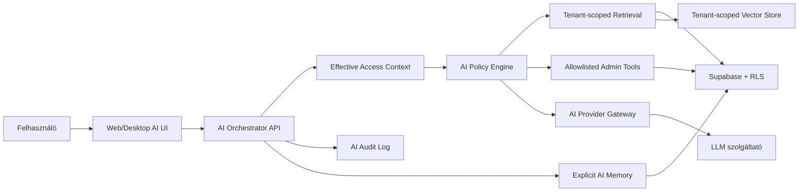

# KARTOTEKA AI asszisztens + GDPR kivitelezési terv

**Dátum:** 2026-04-29  
**Cél:** olyan AI asszisztens bevezetése, amely gyülekezetenként elkülönítve dolgozik, ellenőrzötten "emlékezik", és adminisztratív segítséget ad a Kartotéka rendszerben.  
**Státusz:** tervezet, jogi/DPO validáció előtt.

## Vezetői döntés

Az AI asszisztens bevezethető, de csak **privacy-by-design** architektúrával:

- Az AI nem kaphat korlátlan adatbázis-hozzáférést.
- A "memória" nem lehet rejtett modellmemória; saját, auditálható adatmodellben kell tárolni.
- Minden lekérdezést és memóriát `congregation_id` szerint kell szeparálni.
- Jelentős hatású döntést nem hozhat önállóan; csak ember által ellenőrizhető javaslatot adhat.
- Külső AI szolgáltató csak adatfeldolgozói szerződéssel, tiltott tréningfelhasználással, ismert adatmegőrzéssel és transzfergaranciákkal használható.

## Jelenlegi rendszerhez illesztés

A repo alapján a Kartotéka most ezekre az alapokra épül:

- Web: Next.js 16.2.2, App Router, Server Actions, `apps/web`.
- Desktop: Tauri 2 + React + Vite, `apps/desktop`.
- Backend/adat: Supabase, RLS-re épülő hozzáférés, `congregation_id` alapú scope.
- Offline: Tauri oldalon SQLCipher-es SQLite, outbox és pull/push sync.
- Jogosultság: több szerepkör és aktív scope, például `lelkesz`, `esperes`, `admin`, `konyvelo`, `egyhazmegyei_szamvevo`.
- Már van AI belépési pont: `apps/web/app/api/ai/chat/route.ts`.

Fontos megállapítás: a jelenlegi AI route alapvetően chatbot-fallback logika. Nem ad teljes kartotéka-hozzáférést, ami jó kiindulópont, de GDPR-kompatibilis adminisztratív asszisztenshez még hiányzik a tenant-scope, adatminimalizált retrieval, audit, memória-kezelés, provider governance, rate limit és adatvédelmi kontroll.

## Jogszabályi alap

Ez nem jogi szakvélemény, hanem műszaki kivitelezési terv. A végső jogalapokat DPO/adatvédelmi jogász validálja.

Kötelezően figyelembe veendő keretek:

- GDPR 9. cikk: vallási meggyőződésre utaló adat különleges adat. Gyülekezeti nyilvántartásnál ezt alapértelmezésként így kell kezelni.
- GDPR 25. cikk: adatvédelem beépítve és alapértelmezetten.
- GDPR 28. cikk: adatfeldolgozói szerződés külső szolgáltatókkal.
- GDPR 30. cikk: adatkezelési nyilvántartás.
- GDPR 32. cikk: biztonsági intézkedések.
- GDPR 35. cikk: DPIA, mivel új technológia, különleges adat, memória/profilozás-közeli funkció és több tenant érintett.
- GDPR 37. cikk: DPO szükségességének vizsgálata, nagy skálájú különleges adatkezelés esetén erősen releváns.
- GDPR 22. cikk: jelentős hatású, kizárólag automatizált döntések tiltása/korlátozása.
- EU AI Act 4. cikk: AI literacy, azaz az AI-t kezelők képzése.
- EU AI Act 5. cikk: tiltott AI gyakorlatok kerülése.
- EU AI Act 50. cikk: AI-interakció és AI-generált tartalom átláthatósága.

Források:

- GDPR hivatalos szöveg: https://eur-lex.europa.eu/legal-content/EN/TXT/?uri=CELEX:02016R0679-20160504
- EDPB controller/processor iránymutatás: https://www.edpb.europa.eu/our-work-tools/our-documents/guidelines/guidelines-072020-concepts-controller-and-processor-gdpr_en
- EU AI Act hivatalos szöveg: https://eur-lex.europa.eu/eli/reg/2024/1689/oj

## Célfunkciók

### Első kiadás

Az első GDPR-biztos kiadásban az asszisztens:

- segít a rendszer használatában;
- válaszol modulokkal kapcsolatos kérdésekre;
- lekérdez adatokat csak a felhasználó saját vagy aktív gyülekezeti scope-jából;
- összefoglal gyülekezeti adminisztrációs adatokat;
- előkészít listákat, teendőket, levélvázlatokat;
- javasol memóriát, de nem ment automatikusan érzékeny emléket;
- minden adatforrását jelzi vagy visszakövethetővé teszi.

### Későbbi kiadások

Később engedhető:

- pénzügyi adminisztratív előkészítés;
- hiányzó adatok felismerése;
- dokumentum- és jegyzőkönyv-vázlat készítés;
- munkanapló és iktatás asszisztált kitöltése;
- gyülekezeti éves jelentés előkészítő ellenőrzése;
- desktop kliensből online AI használat, lokális érzékeny adatok minimalizált beküldésével.

### Kifejezetten nem cél

Az AI nem végezheti:

- tagsági státusz automatikus eldöntését;
- fegyelmi, kizárási, segélyezési, választói vagy presbiteri jogosultsági döntést;
- lelkigondozási profilozást;
- gyermekekre vonatkozó automatikus kockázatértékelést;
- egészségügyi, érzelmi, biometrikus vagy pszichológiai következtetést;
- cross-tenant összehasonlítást az érintett gyülekezetek kifejezett jogosultsága nélkül.

## Adatvédelmi alapelvek

### 1. Tenant isolation minden rétegben

Nem elég a UI-ban szűrni. Az izolációnak ezekben a rétegekben is meg kell lennie:

- Supabase RLS;
- Server Action / API route;
- AI retrieval;
- tool-call végrehajtás;
- vektorindex;
- lokális desktop cache;
- audit log;
- memória táblák.

Minden AI táblában kötelező mező: `congregation_id`.

### 2. Explicit memória

Az AI "emlékezete" legyen normál adatbázis-adat:

- látható;
- szerkeszthető;
- törölhető;
- forráshoz kötött;
- lejárati idővel ellátott;
- jogosultság szerint szűrt;
- auditált.

Tiltott minta: "a modell majd emlékezik".  
Kötelező minta: "a rendszer ment egy jóváhagyott memóriarekordot".

### 3. Adatminimalizálás

Az AI csak azt kapja meg, ami az adott kérdéshez kell:

- a teljes személyi karton helyett konkrét mezők;
- teljes pénzügyi tábla helyett aggregátum vagy szűrt lista;
- lelkigondozási/érzékeny jegyzet alapból kizárva;
- gyermekadat csak külön engedéllyel és szűk célra;
- CNP/azonosító mezők alapból maszkolva.

### 4. Emberi kontroll

Az AI csak javaslatot készít. Minden írási művelethez:

- előnézet;
- emberi jóváhagyás;
- módosíthatóság;
- audit log;
- visszavonható vagy javítható művelet.

### 5. Provider governance

A jelenlegi `OpenRouter`, `Groq`, `Gemini` fallback konfiguráció termékfejlesztési prototípusnak rendben lehet, de különleges adatokkal **nem mehet produkcióba** addig, amíg nincs:

- adatfeldolgozói szerződés;
- no-training garancia;
- adatmegőrzési és törlési feltétel;
- alfeldolgozói lista;
- EU/EGT vagy megfelelő adattovábbítási garancia;
- incidenskezelési vállalás;
- technikai adatbiztonsági dokumentáció.

## Célarchitektúra



## Javasolt modulstruktúra

### Web

- `apps/web/app/api/ai/chat/route.ts`
  - vékony route maradjon;
  - delegáljon az orchestratornak.

- `apps/web/lib/ai/orchestrator.ts`
  - auth;
  - scope feloldás;
  - policy;
  - context build;
  - provider call;
  - audit;
  - response shaping.

- `apps/web/lib/ai/provider-gateway.ts`
  - provider választás;
  - timeout;
  - retry;
  - no-sensitive fallback;
  - token limit;
  - response normalizálás.

- `apps/web/lib/ai/context-builder.ts`
  - minimális kontextus összeállítása;
  - mezőszintű maszkolás;
  - modul-szintű allowlist.

- `apps/web/lib/ai/tools/*.ts`
  - csak előre definiált toolok;
  - nincs raw SQL;
  - nincs tetszőleges Supabase query.

- `apps/web/lib/ai/memory.ts`
  - memória javaslat;
  - memória mentés;
  - memória törlés;
  - memória export.

### Közös csomagok

- `packages/core/src/ai`
  - use-case-ek: `askAssistantUseCase`, `proposeMemoryUseCase`, `approveMemoryUseCase`.

- `packages/validations/src/ai`
  - Zod sémák chathez, tool inputhoz, memória rekordhoz.

- `packages/schema-types/src`
  - AI domain típusok, ha a jelenlegi placeholder csomagot elkezdjük valóban használni.

### Desktop

- Első körben az AI legyen online-only.
- Desktopból csak szerveren át menjen AI hívás.
- Lokális SQLCipher adatból küldött kontextus csak explicit user action után mehessen.
- Offline módban az AI UI jelezze: "AI csak online módban elérhető".

## Adatmodell

### `ai_assistant_settings`

Gyülekezetenkénti beállítás.

Javasolt mezők:

- `id uuid primary key`
- `congregation_id uuid not null`
- `enabled boolean not null default false`
- `provider_policy text not null`
- `memory_mode text not null` (`off`, `suggest_only`, `approved`)
- `allowed_modules jsonb not null default '[]'`
- `sensitive_modules_blocked boolean not null default true`
- `raw_log_retention_days int not null default 30`
- `memory_retention_days int null`
- `created_at timestamptz not null default now()`
- `updated_at timestamptz not null default now()`

### `ai_conversation_threads`

Beszélgetési szálak.

Javasolt mezők:

- `id uuid primary key`
- `congregation_id uuid not null`
- `user_id uuid not null`
- `scope_type text not null`
- `scope_id uuid null`
- `title text null`
- `created_at timestamptz not null default now()`
- `updated_at timestamptz not null default now()`
- `retention_until timestamptz null`
- `deleted_at timestamptz null`

### `ai_messages`

AI üzenetek, rövid megőrzéssel.

Javasolt mezők:

- `id uuid primary key`
- `thread_id uuid not null`
- `congregation_id uuid not null`
- `user_id uuid null`
- `role text not null` (`user`, `assistant`, `system`, `tool`)
- `content_redacted text not null`
- `content_hash text not null`
- `sensitivity_level text not null`
- `model text null`
- `provider text null`
- `token_input int null`
- `token_output int null`
- `created_at timestamptz not null default now()`
- `deleted_at timestamptz null`

Alapértelmezés: nyers prompt ne legyen hosszú távon tárolva. Audit célra redaktált változat és hash elég.

### `ai_memory_entries`

Az asszisztens explicit, jóváhagyható memóriája.

Javasolt mezők:

- `id uuid primary key`
- `congregation_id uuid not null`
- `subject_type text not null` (`person`, `family`, `congregation`, `finance`, `document`, `user`)
- `subject_id uuid null`
- `category text not null`
- `content text not null`
- `source_type text not null`
- `source_id uuid null`
- `status text not null` (`proposed`, `approved`, `rejected`, `expired`)
- `sensitivity_level text not null`
- `created_by uuid not null`
- `approved_by uuid null`
- `created_at timestamptz not null default now()`
- `approved_at timestamptz null`
- `expires_at timestamptz null`
- `deleted_at timestamptz null`

Szabály: `status='proposed'` memóriát az AI felhasználhatja maximum a következő válasz magyarázatához, de tartós személyes emlékként csak `approved` állapotban.

### `ai_tool_calls`

Minden tool-hívás naplózása.

Javasolt mezők:

- `id uuid primary key`
- `thread_id uuid null`
- `congregation_id uuid not null`
- `user_id uuid not null`
- `tool_name text not null`
- `input_redacted jsonb not null`
- `result_summary jsonb null`
- `row_refs jsonb null`
- `status text not null`
- `error text null`
- `created_at timestamptz not null default now()`

### `ai_audit_log`

Biztonsági audit.

Javasolt mezők:

- `id uuid primary key`
- `event_type text not null`
- `congregation_id uuid null`
- `user_id uuid null`
- `actor_role text null`
- `scope jsonb not null`
- `metadata jsonb not null`
- `ip_hash text null`
- `user_agent_hash text null`
- `created_at timestamptz not null default now()`

### `ai_context_documents` és `ai_embeddings`

RAG esetén külön táblák:

- `congregation_id` kötelező;
- `source_table`;
- `source_id`;
- `source_revision`;
- `content_redacted`;
- `access_level`;
- `module`;
- `embedding`;
- `expires_at`;
- `deleted_at`.

A vector search függvény csak olyan sorokat adhat vissza, amelyek `congregation_id` és jogosultsági scope szerint is engedélyezettek.

## RLS és jogosultsági terv

### Közös RLS alapelv

Minden AI tábla RLS policyja:

- csak bejelentkezett user;
- csak saját aktív gyülekezeti scope;
- admin override csak aktív, időzített god-mode session alatt;
- könyvelő csak pénzügyi scope-ban;
- számvevő review/read-only scope-ban;
- memória jóváhagyás csak megfelelő role esetén.

### Kötelező szerveroldali ellenőrzés

Az AI route nem hagyatkozhat csak RLS-re. Minden kérés elején:

1. `getEffectiveAccessContext()`
2. `effectiveCongregationId` kötelező, kivéve system-level help kérdések
3. `allowedModules` feloldás role alapján
4. provider policy ellenőrzés
5. sensitivity policy ellenőrzés
6. rate limit ellenőrzés

### Service role használata

Service role kulcsot AI útvonalon alapból kerülni kell. Ha mégis kell Edge Functionben:

- külön function;
- explicit access check;
- semmilyen user-controlled raw query;
- audit log minden hívásra;
- tesztelt negatív esetek.

## AI policy engine

Minden kérés kapjon policy döntést:

```ts
type AiPolicyDecision = {
  allowed: boolean
  reason?: string
  congregationId: string | null
  modules: string[]
  canUsePersonalData: boolean
  canUseFinancialData: boolean
  canUseChildrenData: boolean
  canWriteMemory: boolean
  canCallTools: string[]
  maxContextRows: number
  redactionProfile: 'strict' | 'normal' | 'admin'
}
```

Példa döntések:

- Rendszerhasználati kérdés: személyes adat nélkül engedhető.
- "Kiknek van születésnapja jövő héten?": csak saját gyülekezetből, minimális mezőkkel.
- "Írj emlékeztetőt X család tartozásáról": csak pénzügyi jogosultsággal, érzékeny adatok nélkül.
- "Kik gyengék hitben?": tiltás, mert szubjektív lelkigondozási profilozás.
- "Rangsorold a tagokat adakozási hajlandóság szerint": tiltás, social scoring/profilozás-közeli kockázat.

## Tool rendszer

Az AI csak allowlistelt toolokat hívhat.

Első körös read-only toolok:

- `get_congregation_summary`
- `search_members_minimal`
- `get_member_admin_snapshot`
- `list_upcoming_birthdays`
- `list_missing_member_fields`
- `list_recent_worklog_entries`
- `summarize_finance_period`
- `search_documents_metadata`

Második körös write-proposal toolok:

- `draft_worklog_entry`
- `draft_letter`
- `draft_filing_record`
- `propose_member_update`
- `propose_memory_entry`
- `create_task_proposal`

Közvetlen írás csak később:

- emberi előnézet után;
- explicit gombbal;
- meglévő Server Action/use-case validációval;
- audit loggal;
- optimistic concurrency/revision kezeléssel.

## Redakció és maszkolás

Alapértelmezett maszkolás:

- CNP és személyi azonosítók: teljes maszkolás, utolsó 2-4 karakter sem szükséges az AI-nak.
- Telefonszám/email: csak ha kommunikációs feladat indokolja.
- Lakcím: település/szűkített cím, ha teljes cím nem kell.
- Pénzügyi tételek: aggregátum előnyben, személyes bontás csak jogosulttal.
- Gyermekadat: alapból kizárva.
- Lelkigondozási jegyzet: alapból kizárva.
- Egészségügyi adat: kizárva, külön DPIA és külön jogalap nélkül nem mehet AI-ba.

## Memória életciklus

1. AI javasol egy memóriát.
2. UI megmutatja: mit mentene, kiről, milyen forrásból, meddig.
3. Felhasználó jóváhagyja, szerkeszti vagy elutasítja.
4. Jóváhagyott memória `approved` állapotba kerül.
5. Minden felhasználáskor auditba kerül, hogy mely memóriarekordok adtak kontextust.
6. Lejáratkor `expired`.
7. Törléskor soft delete + külön törlési audit.

Fontos: személyre vonatkozó memória a személy adatlapján is legyen látható.

## Adatalanyi jogok

Kell egy "AI adatlap" nézet legalább admin/lelkész oldalon:

- "Mit tárol az AI erről a személyről?"
- "Milyen beszélgetésekben szerepelt?"
- "Milyen memória készült róla?"
- "Mikor és ki hagyta jóvá?"
- "Exportálás"
- "Törlés/kifogás jelölése"

Ezt később össze lehet kötni a teljes GDPR export/törlés workflow-val.

## Audit és naplózás

Naplózni kell:

- ki kérdezett;
- melyik gyülekezeti scope-ban;
- milyen modulhoz nyúlt;
- mely toolok futottak;
- milyen forrásrekordok kerültek kontextusba;
- milyen provider/model válaszolt;
- történt-e memóriajavaslat;
- történt-e írási javaslat;
- történt-e tiltás.

Nem célszerű hosszú távon tárolni:

- teljes nyers promptot;
- teljes LLM választ érzékeny adatokkal;
- külső provider teljes raw response-át.

Helyette:

- redaktált tartalom;
- hash;
- metadata;
- forrásreferencia.

## Incidens- és kockázatkezelés

Kezelendő fő kockázatok:

- cross-tenant adatszivárgás;
- túl sok személyes adat küldése providernek;
- prompt injection;
- hallucinált adminisztratív állítás;
- hibás pénzügyi vagy tagsági javaslat;
- törölt adat visszakerülése vektorindexből;
- memória túl sokáig megmarad;
- admin override túl széles használata;
- free AI provider ismeretlen adatkezelése.

Kötelező mitigációk:

- tenant-scope tesztek;
- provider gateway;
- tool allowlist;
- redakció;
- memória jóváhagyás;
- retention job;
- audit export;
- manual review;
- kikapcsolható AI gyülekezetenként.

## Kivitelezési roadmap

### A-M9.0: Jogi és adatvédelmi előkészítés

Idő: 2-4 nap, jogi/DPO függő.

Feladatok:

- adatkezelő/adatfeldolgozó szerepek rögzítése;
- AI célok és kizárt célok elfogadása;
- DPIA vázlat elkészítése;
- adatkezelési nyilvántartás frissítése;
- provider shortlist;
- provider DPA/no-training/retention ellenőrzés;
- gyülekezeti AI bekapcsolási szabály;
- AI használati szabályzat vázlat;
- AI literacy mini képzési anyag.

Definition of Done:

- van jóváhagyott "AI használati keret";
- produkciós provider nincs bekapcsolva jogi ellenőrzés nélkül;
- le van írva, mi tilos az asszisztensnek.

### A-M9.1: AI safety foundation

Idő: 2-3 nap.

Feladatok:

- meglévő `apps/web/app/api/ai/chat/route.ts` vékonyítása;
- `apps/web/lib/ai/orchestrator.ts` létrehozása;
- auth és `getEffectiveAccessContext()` bekötése;
- rate limit user + congregation szinten;
- provider gateway;
- redaktált audit log alap;
- system prompt verziózás;
- gyülekezeti AI beállítás tábla;
- AI kikapcsolás alapértelmezetten.

Első kiadásban az asszisztens még csak rendszerhasználati kérdésekre válaszolhat, személyes adatot nem kap.

Definition of Done:

- kijelentkezett user 401;
- AI disabled gyülekezetben 403;
- provider error nem szivárogtat technikai secretet;
- audit log létrejön;
- nincs adatbázis retrieval.

### A-M9.2: Tenant-safe read-only context

Idő: 4-6 nap.

Feladatok:

- `ai_policy_engine` létrehozása;
- read-only toolok első készlete;
- személykeresés minimális mezőkkel;
- gyülekezeti összefoglaló;
- születésnap/hiányzó mezők listája;
- pénzügyi aggregátum csak jogosult role esetén;
- RLS policy AI táblákra;
- negatív tesztek másik gyülekezet adatára.

Definition of Done:

- a lelkész csak saját gyülekezetet lát;
- könyvelő csak assigned gyülekezet pénzügyi scope-ját látja;
- admin nem kap automatikusan minden adatot god-mode nélkül;
- a toolok nem fogadnak tetszőleges SQL-t;
- minden tool-call auditált.

### A-M9.3: Explicit memória

Idő: 4-6 nap.

Feladatok:

- `ai_memory_entries` tábla;
- memóriajavaslat generálás;
- memória jóváhagyó UI;
- személy adatlapján AI memória panel;
- memória törlés/szerkesztés;
- memory retrieval csak `approved` állapotból;
- lejárati és retention job;
- export/törlés alapfunkció.

Definition of Done:

- AI nem ment automatikusan személyes emléket;
- felhasználó látja, mit mentene;
- törölt memória nem kerül vissza kontextusba;
- auditból visszanézhető, mikor melyik memória szerepelt.

### A-M9.4: RAG és dokumentum-kontekstus

Idő: 5-8 nap.

Feladatok:

- `ai_context_documents` és `ai_embeddings`;
- forrásrekord-revízió kezelés;
- deleted/soft-deleted rekordok kizárása;
- tenant-scoped vector search function;
- idézett források megjelenítése;
- dokumentum metaadatok előnyben a teljes tartalommal szemben;
- prompt injection szűrés dokumentumoknál.

Definition of Done:

- vector search nem ad vissza más gyülekezetből sort;
- törölt forrás rekord eltűnik az indexből;
- válasz tartalmaz forrásreferenciát;
- nem lehet dokumentumból rendszerutasítást injektálni.

### A-M9.5: Adminisztratív write-proposals

Idő: 5-8 nap.

Feladatok:

- munkanapló-vázlat;
- iktatási rekord-vázlat;
- tagadat módosítási javaslat;
- levélvázlat;
- teendőjavaslat;
- preview + emberi jóváhagyás;
- meglévő use-case/Server Action validációk újrahasználása;
- audit log.

Definition of Done:

- AI nem ír közvetlenül adatot;
- minden javaslat szerkeszthető;
- mentéskor meglévő validáció fut;
- hibás AI javaslat nem kerül be automatikusan.

### A-M9.6: Desktop integráció

Idő: 3-6 nap.

Feladatok:

- desktop AI panel online-only módban;
- lokális SQLCipher adatokból csak explicit user-kérésre épülhet kontextus;
- offline módban AI inaktív vagy csak lokális súgó;
- outbox-szal AI írási javaslatot nem küldünk automatikusan;
- sync állapot megjelenítése az AI UI-ban.

Definition of Done:

- offline PIN mód nem küld AI hívást;
- providerhez nem kerül lokális cache teljes tartalma;
- user látja, ha a válasz lokális cache-ből vagy szerveradatból dolgozott.

### A-M9.7: Governance, tesztek, rollout

Idő: 4-6 nap.

Feladatok:

- RLS negatív tesztek;
- prompt injection tesztek;
- redakciós tesztek;
- provider timeout/retry tesztek;
- DPIA véglegesítés;
- adatkezelési tájékoztató frissítése;
- user training;
- pilot 1-2 gyülekezeten;
- audit review;
- fokozatos bekapcsolás.

Definition of Done:

- pilot előtt AI alapból mindenhol kikapcsolt;
- pilot gyülekezet explicit bekapcsolja;
- mérhető audit riport van;
- DPO/jogász jóváhagyta a keretet.

## Tesztstratégia

### Kötelező negatív tesztek

- User A gyülekezetből nem tud User B gyülekezetére kérdezni.
- AI tool nem fogad el módosított `congregation_id`-t kliensből.
- Admin god-mode nélkül nem kap gyülekezeti személyadatot.
- Törölt személy nem jelenik meg retrievalben.
- Törölt memória nem kerül promptba.
- CNP nem megy providernek.
- Gyermekadat nem megy alapértelmezett kontextusba.
- Pénzügyi személyes bontás nem megy nem jogosult role-nak.

### Kötelező minőségi tesztek

- Forrásreferenciák helyesek.
- Hallucinált állítás esetén az AI jelzi a bizonytalanságot.
- Provider kiesésnél kulturált hibaüzenet.
- Rate limit működik.
- Audit logból rekonstruálható az adatút.

## UI terv

### Chat panel

- egyértelmű jelzés: AI asszisztenssel beszél a felhasználó;
- gyülekezeti scope látható;
- válaszban források;
- "Ezt mentsük emlékként?" javaslat;
- "Nem helyes" feedback;
- "Ne használja ezt az adatot AI-hoz" opció érzékeny elemeknél.

### AI beállítások

Gyülekezeti admin/lelkész panel:

- AI bekapcsolva/kikapcsolva;
- engedélyezett modulok;
- memória mód;
- adatmegőrzési napok;
- provider státusz;
- audit export;
- tiltott adatkategóriák.

### Személy adatlap

Új szekció:

- AI memória;
- forrás;
- jóváhagyó;
- lejárat;
- törlés/szerkesztés.

## Retention javaslat

Induló értékek:

- redaktált üzenetlog: 30 nap;
- tool-call audit: 180 nap vagy szervezeti audit policy szerint;
- jóváhagyott memória: célhoz kötött, alapból 1 év felülvizsgálattal;
- elutasított memóriajavaslat: 7-30 nap;
- provider raw response: nem tároljuk;
- embedding: forrásrekord élettartamához kötött.

## Provider választási kritérium

Produkcóba csak olyan provider:

- amely szerződésben vállalja, hogy a beküldött adatot nem használja tréningre;
- biztosít adatfeldolgozói szerződést;
- megadja adatmegőrzési idejét;
- támogatja törlési/incidens folyamatot;
- dokumentálja alfeldolgozóit;
- alkalmas EU/EGT adatkezelésre vagy megfelelő transzfergaranciára;
- nem free/community endpoint érzékeny adatokkal.

Ajánlott döntés: első produkciós pilotban csak egy jóváhagyott provider legyen, fallback nélkül. A multi-provider fallback növeli az adatvédelmi és audit komplexitást.

## Rollout stratégia

1. Dev-only chatbot személyes adat nélkül.
2. Belső admin pilot rendszerhasználati kérdésekre.
3. Egy gyülekezeti pilot read-only toolokkal.
4. Memória csak javaslatként.
5. Memória jóváhagyással.
6. Írási javaslatok emberi jóváhagyással.
7. Szélesebb bekapcsolás gyülekezetenként.

## Döntési pontok

Kivitelezés előtt dönteni kell:

- Ki az adatkezelő: központi egyház, gyülekezet, vagy közös adatkezelés?
- Melyik provider lehet produkciós?
- Mehet-e bármilyen személyes adat külső LLM-nek?
- Kell-e self-host vagy EU-only opció?
- Ki hagyhat jóvá AI memóriát?
- Mely modulok kizártak első körben?
- Mennyi legyen a retention?
- Külön kell-e DPO jóváhagyás minden pilot gyülekezethez?

## Ajánlott első konkrét fejlesztési csomag

Elsőként az A-M9.1-et érdemes megcsinálni:

- AI settings tábla;
- AI alapból kikapcsolva;
- orchestrator skeleton;
- effective access context;
- provider gateway;
- redaktált audit log;
- rendszerhasználati chatbot személyes adat nélkül;
- jogi figyelmeztetés és AI disclosure.

Ez ad biztonságos alapot anélkül, hogy rögtön különleges személyes adatot küldenénk külső modellnek.

## Rövid konklúzió

A Kartotéka jelenlegi architektúrája jó alap: már létezik gyülekezeti scope, RLS-re épülő gondolkodás, offline sync és audit-szerű projektfegyelem. Az AI-t viszont külön védelmi rétegként kell bevezetni. A legfontosabb döntés: az asszisztens ne "mindentudó chatbot" legyen, hanem jogosultságokkal, minimális kontextussal, explicit memóriával és emberi jóváhagyással működő adminisztratív segéd.
